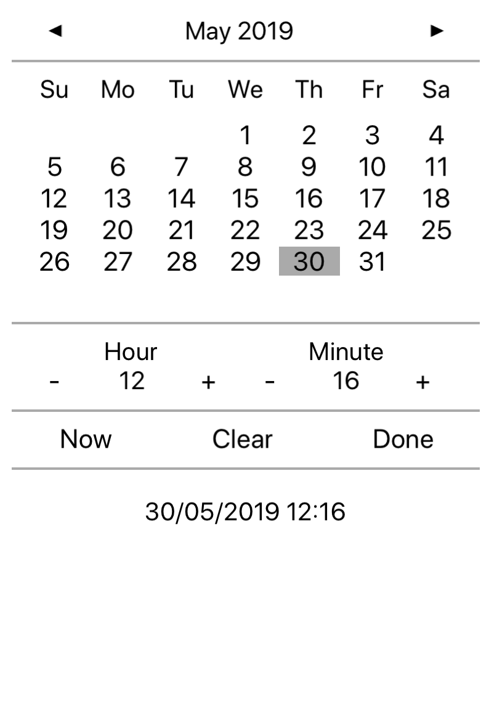

# iOS DateTimePicker in Xamarin
## An alternative datetime picker for iOS tablets in C#
The classic iOS datetime picker is great for phones but IMHO looks a bit clunky on iPads expecially when in landscape orientation. In particular, when you are developing a cross platform app and want the look and feel to be consistent accross devices then this control offers a UI which will be loosly similar to other platforms.

Here is an alternative which uses a more common way to enter a date and time on iPads.

The picker supports nullable values which is always useful for search forms and so on.

It will resize itself according to how much screen space you provide.
Navigate quickly to an alternative year by tapping the Month/Year header. Now, Clear and Done buttons fire events which can be handled.

The Datetime to be edited is provided to the control's Value property, this can be set to null

The control exposes a number of properties which allow you to customise the UI and behaviour of the control, these are commented in the source for DateTimePicker.

I have provided a simple iOS project to demonstrate the picker in use. Use the "Smaller" and "Bigger" buttons to illustrate scaling.

The control is also simple to use with Xamarin.Forms. You will need to create a custom renderer and ensure that your layout defines screen space for the control. I have used the ever popular [Rg.Plugins.Popup](https://github.com/rotorgames/Rg.Plugins.Popup) to display this picker with Forms. I will try and find some time to publish a Forms binder for both iOS and Android.
