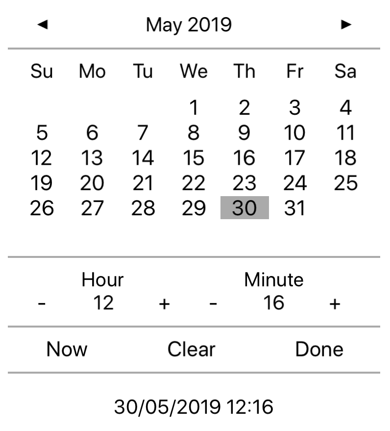

# iOS DateTimePicker in Xamarin
## An alternative datetime picker for iOS tablets in C#
The classic iOS datetime picker is great for phones but IMHO looks a bit clunky on iPads expecially when in landscape orientation.
Here is an alternative which uses a more common way to enter a date and time.

The picker supports nullable values which is always useful for search forms and so on.

It will resize itself according to how much screen space you provide.
Navigate quickly to an alternative year by tapping the Month/Year header. Now. Clear and Done buttons fire events which can be handled.
